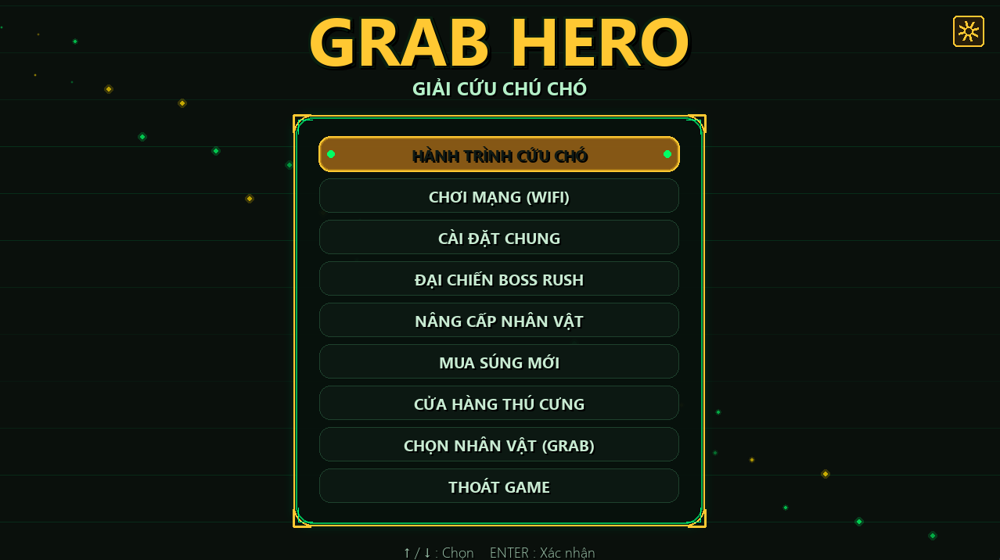
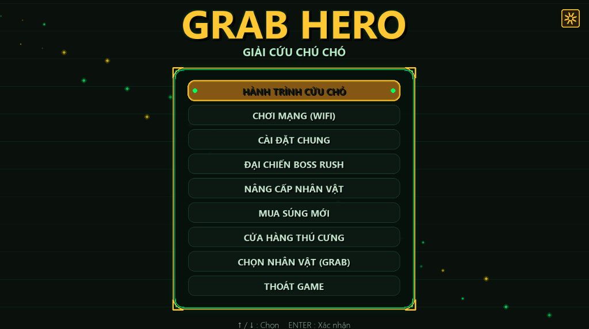
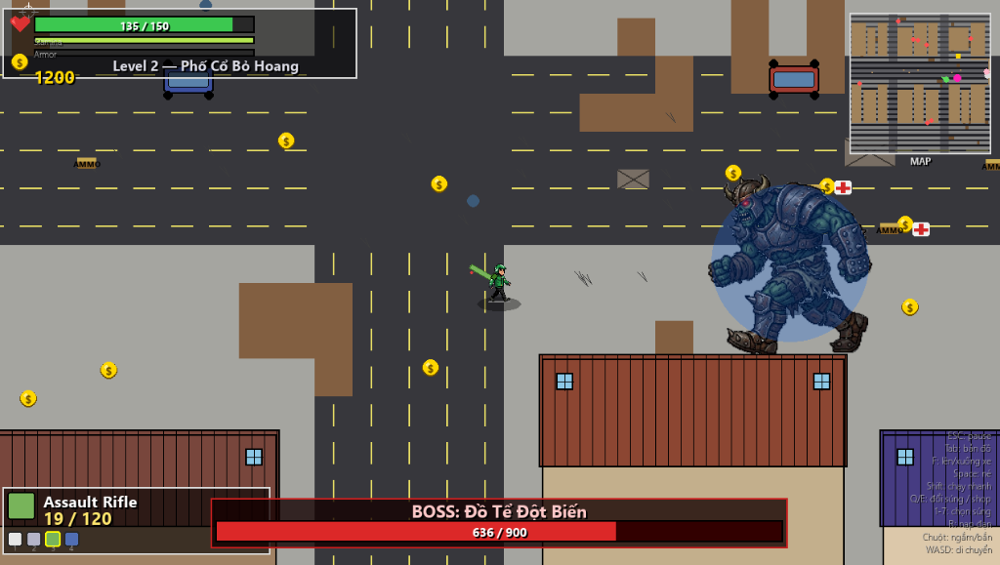
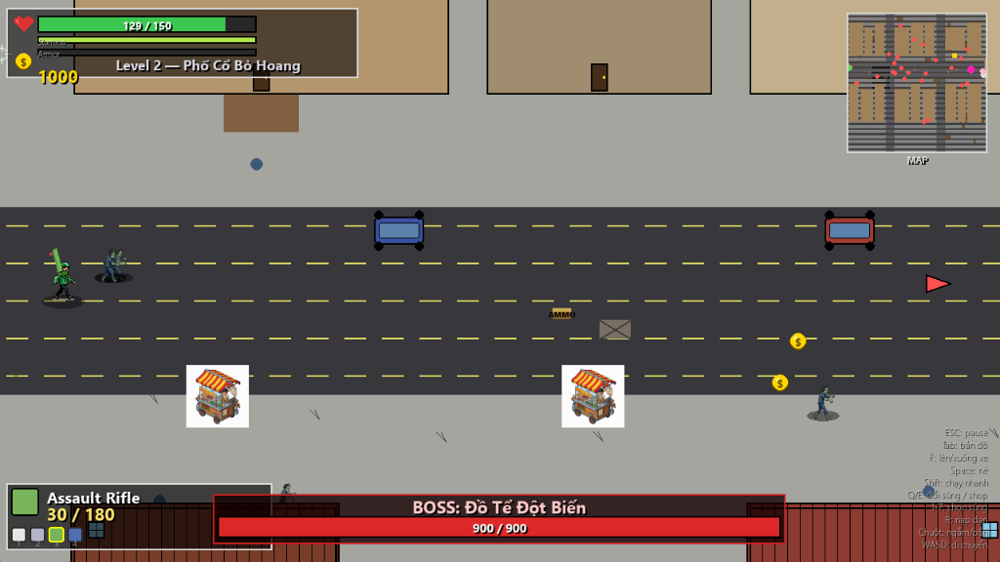
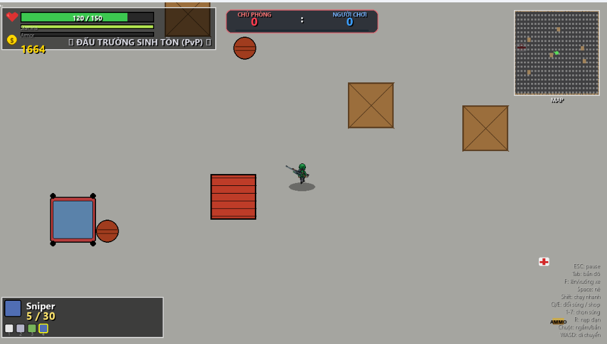

# 🏍️ GRAB HERO - HÙNG THẦN SHIPPER 🎮
Một tựa game bắn súng hành động 2D góc nhìn từ trên xuống (Top-Down Shooter) vô cùng kịch tính, vui nhộn và đậm chất Việt Nam! Bạn sẽ vào vai những tài xế công nghệ huyền thoại (Grab và Shopee) chiến đấu chống lại đại dịch Zombie, giải cứu chú chó cưng và quyết chiến sinh tử PvP cùng bạn bè!

<p align="center">
  
  <br>
  <em>📸 <b>Game Cover / Banner:</b> Giao diện bắt đầu và hình ảnh đại diện chính thức của game</em>
</p>

---

## 🌟 CÁC TÍNH NĂNG NỔI BẬT

### 1. 🎭 Lựa Chọn Nhân Vật Độc Đáo (Pixel Art 8-Bit)
* **Grab Hero:** Tài xế Grab nhanh nhẹn, linh hoạt với bộ trang phục xanh lá đặc trưng.
* **Shopee Hero:** Hùng thần Shopee Food nhiệt huyết với bộ trang phục cam nổi bật, chiếc túi giao hàng sau lưng cực kỳ chi tiết.
* **Hệ thống Sprite 4 hướng sắc nét:** Cả hai nhân vật đều sở hữu bộ ảnh chuyển động 4 hướng cực kỳ sắc sảo (Pixel-Perfect), chuyển động mượt mà khi đi lên, đi xuống, rẽ trái, rẽ phải.

### 🎮 2. Chế Độ Chơi Phong Phú & Kịch Tính
* **Chế Độ Chiến Dịch (Campaign):** Khám phá 7 màn chơi với độ khó tăng dần, đối mặt với các chủng loại Zombie tinh quái và các Thủ Lĩnh (Boss) khổng lồ như Chúa Tể Umbrella.
* **Chế Độ Giải Cứu Chó Cưng (Dog Rescue):** Màn chơi mở rộng hành động nhập vai sinh tồn đầy cảm xúc. Bạn phải dọn sạch các ổ trộm chó, hạ gục hổ dữ để giải cứu chú cưng của mình.
* **Chế Chộ Quyết Chiến PvP (Solo LAN/Wifi):**
  * Kết nối trực tiếp giữa hai người chơi trong cùng một mạng LAN hoặc Wifi.
  * **Hồi sinh ngẫu nhiên:** Khi bị bắn hạ, người chơi sẽ ngay lập tức được hồi sinh ngẫu nhiên tại các điểm an toàn trên bản đồ.
  * **Đua điểm kịch tính:** Bên nào đạt được **10 mạng hạ gục trước** sẽ giành chiến thắng chung cuộc!
  * Đồng bộ hóa đạn, máu và vị trí giữa máy Chủ (Host) và máy Khách (Client) thời gian thực không giật lag.

### 🎨 3. Giao Diện Cyberpunk Kính Mờ Đẳng Cấp
* Giao diện sảnh chờ (Lobby) mang phong cách **Glassmorphism / Cyberpunk** với các tấm nền kính mờ bo tròn góc 14px siêu sang trọng.
* **Hỗ trợ chuột hoàn hảo:** Bạn có thể dùng chuột để bấm nút Menu, chọn nhân vật, hoặc cuộn chọn vũ khí. Các nút bấm có hiệu ứng phát sáng phản hồi (Hover) cực kỳ bắt mắt.

### 🔫 4. Kho Vũ Khí & Tiếp Tế Đa Dạng
* **Súng lục (Pistol):** Vũ khí cơ bản vô hạn đạn.
* **Súng săn (Shotgun):** Sức sát thương diện rộng cực lớn ở cự ly gần.
* **Súng tiểu liên (SMG):** Tốc độ xả đạn cực nhanh, áp đảo đám đông zombie.
* **Súng bắn tỉa (Sniper):** Tầm bắn xa siêu việt, sát thương chí mạng kết liễu kẻ thù.
* **Tiếp tế thuần Việt:** Bánh mì và Tô phở nóng hổi xuất hiện trên bản đồ giúp hồi phục thể lực và lượng máu hao hụt.

---

## 🕹️ HƯỚNG DẪN ĐIỀU KHIỂN

| Hành động | Bàn phím & Chuột | Bàn phím thuần |
| :--- | :--- | :--- |
| **Di chuyển** | `W`, `A`, `S`, `D` | `W`, `A`, `S`, `D` |
| **Lướt né chiêu (Dash)** | Phím Cách (`Space`) | Phím Cách (`Space`) |
| **Ngắm bắn** | Di chuyển Con trỏ chuột | Phím Mũi tên (`↑`, `↓`, `←`, `→`) |
| **Bắn** | **Chuột trái** | Tự động bắn theo hướng di chuyển |
| **Đổi vũ khí** | Phím `Q` / `E` hoặc Cuộn chuột | Phím `Q` / `E` |
| **Tương tác Menu** | Click chuột trái trực tiếp | Dùng phím hướng và `Enter` |

---

## 🌐 HƯỚNG DẪN CHƠI PVP 1V1 QUA WIFI/LAN

Để solo chiến đấu cùng bạn bè cực kỳ đơn giản:
1. **Máy Chủ (Host - Người lập phòng):**
   * Vào Menu PvP, lấy địa chỉ IP LAN của máy mình (ví dụ: `192.168.1.15`) gửi cho bạn bè.
   * Chọn nhân vật và bấm **Tạo Phòng (Host Game)**.
2. **Máy Khách (Client - Người vào phòng):**
   * Vào Menu PvP, nhập địa chỉ IP của máy Chủ đã gửi vào ô kết nối.
   * Chọn nhân vật và bấm **Vào Phòng (Join Game)**.
3. Khi cả hai đã kết nối thành công, trận chiến PvP 10 mạng hồi sinh kịch tính sẽ chính thức bắt đầu!

---

## 🚀 HƯỚNG DẪN CÀI ĐẶT & CHẠY GAME

### Cách 1: Chạy trực tiếp từ file EXE (Khuyên dùng cho người chơi)
Bạn chỉ cần truy cập vào thư mục `dist`, click đúp vào tệp tin chạy duy nhất:
👉 **[GrabHero.exe](file:///c:/Users/LAPTOP/Downloads/grab_hero%20(1)/dist/GrabHero.exe)** là có thể tận hưởng trò chơi ngay lập tức mà không cần cài đặt thêm bất kỳ phần mềm nào khác!

### Cách 2: Chạy bằng mã nguồn Python (Dành cho nhà phát triển)
1. Yêu cầu máy tính đã cài đặt **Python 3.10+** và thư viện **Pygame**:
   ```bash
   pip install pygame
   ```
2. Chạy file chạy chính của game:
   ```bash
   python grab_hero/tong/main.py
   ```

### Cách 3: Đóng gói lại ứng dụng thành file EXE độc lập
Nếu bạn có chỉnh sửa mã nguồn và muốn đóng gói lại thành app gửi bạn bè, chỉ cần chạy file:
👉 **[build_app.bat](file:///c:/Users/LAPTOP/Downloads/grab_hero%20(1)/build_app.bat)** hệ thống sẽ tự động build lại phiên bản `.exe` mới nhất lưu vào thư mục `dist`!

---

## 📸 HÌNH ẢNH TRONG GAME (GAMEPLAY SCREENSHOTS)

*Hình ảnh thực tế trải nghiệm gameplay vô cùng sống động trong thế giới Grab Hero:*

| 🌌 Giao Diện Menu Chính | 🧟 Đại Chiến Boss / Zombie |
| :---: | :---: |
| <br><em>Giao diện Menu mới mượt mà, trực quan</em> | <br><em>Đại chiến cực kịch tính với Đồ Tể Đột Biến</em> |

| 🐕 Giải Cứu Chó Cưng | ⚔️ Quyết Chiến PvP 1v1 |
| :---: | :---: |
| <br><em>Màn chơi Phố Cổ Bỏ Hoang thuần Việt</em> | <br><em>Đấu trường PvP 1v1 sinh tử đầy hấp dẫn</em> |

---

Chúc các dũng sĩ Shipper có những giờ phút giao hàng và giao tranh cực kỳ vui vẻ và kịch tính! 🏍️💨🔫
